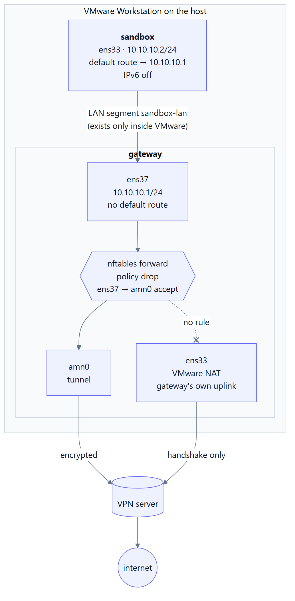

# Architecture and threat model

## The problem

A tester or penetration tester wants a **local, disposable** environment for:

- running untrusted software (malware analysis, app testing),
- performing **authorised** penetration tests without exposing their own IP address and host fingerprint.

A single VM with a VPN client inside it does not solve this well:

1. If the VPN client is not running, crashes, or is killed, the guest falls back to the host's NAT/bridge and traffic leaves with the real IP.
2. Code running in the VM can inspect and modify routing and DNS, undoing the VPN.
3. DNS, IPv6 and UDP paths are easy to leave open by accident.
4. The VM shares a network with the host (NAT/host-only), which is one more surface.

## The model: gateway + sandbox

Two VMs, one isolated link between them.

  <picture>
    <source media="(prefers-color-scheme: dark)" srcset="../images/diagrams/architecture-dark.png">
    
  </picture>

**sandbox**

- One NIC, attached to the VMware **LAN segment** `sandbox-lan`.
- Static IP `10.10.10.2/24`, default gateway `10.10.10.1`, DNS `1.1.1.1`, IPv6 disabled.
- Has no address on any host network. Even with root, the only reachable next hop is the gateway.

**gateway**

- NIC 1 (`ens33`): VMware NAT — uplink to the host and internet. Used only by the gateway itself (VPN handshake, updates).
- NIC 2 (`ens37`): `sandbox-lan`, static `10.10.10.1/24`, no default route.
- Tunnel interface (`amn0` for AmneziaVPN, `wg0` for wg-quick).
- `net.ipv4.ip_forward=1`.
- `nftables` forward chain, **policy drop**, with exactly two rules:
  - `ens37 → amn0` accept
  - `amn0 → ens37` accept, established/related only
- `nat postrouting`: masquerade on `amn0`.

## Why this is a kill-switch

The gateway is the only thing that can move packets from `sandbox-lan` to anywhere. Its forward policy drops everything except traffic entering the tunnel. There is **no rule** that forwards `ens37 → ens33`. So:

- VPN down → `amn0` does not exist → no rule matches → packets dropped. The sandbox is offline, not exposed.
- Malware in the sandbox changes routes → still only one next hop exists, and the gateway still refuses to forward to `ens33`.
- DNS → the sandbox's resolver is reached as ordinary IP traffic through the same forward chain, so it can only go through the tunnel.
- IPv6 → disabled on the sandbox and on the LAN interface of the gateway; the forward chain in `table inet` would drop it anyway because only `amn0` is allowed as egress.

The enforcement point is in the kernel of a *different* VM, out of reach of whatever runs in the sandbox.

## Fingerprint separation

- The sandbox's MAC address is a VMware-generated one, not the host's.
- Hardware IDs, hostname, users, installed software are those of a fresh Debian install, not of the host.
- The sandbox never sees the VMware NAT subnet or the host's LAN — only `10.10.10.0/24`.

## What is out of scope

- **Application-layer identity**: WebRTC, browser fingerprinting, cookies, logged-in accounts. Handle in the browser/apps inside the sandbox.
- **VM escape** or hypervisor bugs.
- **Traffic analysis / correlation** by whoever runs the VPN endpoint. Use your own server or a provider you trust.
- **Host compromise**: if the host is owned, everything is.
- **At-rest protection of host memory/swap**: encrypt the host system disk for that.

## Protocol-agnostic

The kill-switch keys on the tunnel interface name only. Anything that creates a tun/wg interface works: WireGuard, AmneziaWG, OpenVPN (`tun0`), Cloudflare WARP, Tor (with a transparent-proxy setup), etc. Change `VPN_IFACE` in `scripts/config.env` and re-run the gateway script.

## Chaining a second hop (double VPN)

The sandbox's traffic is already confined to the gateway's tunnel, so a VPN client, Tor, or a proxy started *inside the sandbox* nests inside hop 1 without any extra configuration:

- Hop 1 (gateway) sees your real IP but only encrypted hop-2 traffic — no destinations, no content.
- Hop 2 (sandbox) sees destinations but only hop 1's exit IP — never yours.
- If the hop-2 client fails, traffic still leaves through hop 1. If hop 1 fails, the sandbox is offline. Your real IP is never the fallback, which is the property a two-clients-on-one-machine setup cannot give you.

Costs: throughput and latency, MTU tuning for the inner tunnel (`MTU = 1280` is a safe start), and the need to pick two unrelated providers. See the README section *Double VPN* for the who-sees-what breakdown.

## Comparison with Whonix

Whonix implements the same isolating-proxy pattern (Gateway VM + Workstation VM) with Tor, hardened templates and a lot of additional engineering. This project deliberately stays small: stock Debian, NetworkManager, one `nftables` file, and the VPN client of your choice. It is easier to audit and to adapt, at the cost of the extra hardening Whonix provides.
